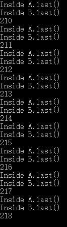

<title>Lab Report for Deadlock</title>
<h1>Lab Report for Deadlock</h1>
<h2>Lab Procedure</h2>
<h3>1. Coding</h3>

Write the java file as follow

	class A{
		synchronized void methodA(B b){
			b.last();
		}
		synchronized void last(){
			System.out.println("Inside A.last()");
		}
	}

	class B{
		synchronized void methodB(A a){
			a.last();
		}
		synchronized void last(){
			System.out.println("Inside B.last()");
		}
	}

	class Deadlock implements Runnable{
		A a=new A();
		B b=new B();

		Deadlock(){
			Thread t = new Thread(this);
			int count = 20000;
			t.start();
			while(count-->0);
			a.methodA(b);
		}

		public void run(){
			b.methodB(a);
		}

		public static void main(String args[]){
			new Deadlock();
		}
	}

<h3>2. Compile</h3>

Take windows for example, write this command into cmd to compile the java file

	javac Deadlock.java

<h3>3. Bat</h3>

Write the following codes into a bat file

	cd /d %~dp0 
	@echo off
	:start
	set/a var+=1
	echo %var%
	java Deadlock
	if %var% leq 1000 GOTO start
	pause

<h3>4. Run</h3>

Run the bat file, the result is as follow

A deadlock occurs in the 218th time

<h2>Analysis</h2>
<h3>Four Necessary Conditions</h3>

**Mutual exclusion:** The resources involved must be unshareable; otherwise, the processes would not be prevented from using the resource when necessary. Only one process can use the resource at any given instant of time.

**Hold and wait or resource holding:** a process is currently holding at least one resource and requesting additional resources which are being held by other processes.

**No preemption:** a resource can be released only voluntarily by the process holding it.

**Circular wait:** a process must be waiting for a resource which is being held by another process, which in turn is waiting for the first process to release the resource. In general, there is a set of waiting processes, P = {P1, P2, …, PN}, such that P1 is waiting for a resource held by P2, P2 is waiting for a resource held by P3 and so on until PN is waiting for a resource held by P1.

<h3>Deadlock Causes</h3>

**Mutual exclusion:**In each class, "synchronized" makes sure the two classes are mutual exclusive.

**Hold and wait or resource holding:** there is no action but waiting when the thread is blocked.

**No preemption:** there is no rules for depriving of the resources gotten by some threads.

**Circular wait:** when the thread is bocked, it be pushed back into the thread queue, waiting for running the next time.

***

In this situation, when thread A is in methodB and thread B is in methodA, they are all waiting for running the function last. So both the threads are blocked and waiting circularly and then deadlock occurs. So if the variable count is smaller, the deadlock will occur earlier as the thread queue will be full earlier, at which the time gap between the two thread is small enough for them obtain one source and wait for another.
To avoid this happen, it should check if there will be a deadlock when the top of the thread queue runs. If the deadlock will occur, put the thread at the back of the thread queue or wait until the next state will not have deadlock.
